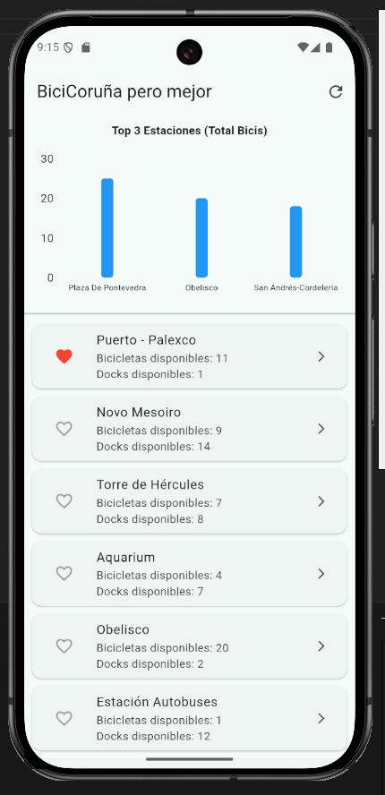

# BiciCoruña pero  Mejor

## Explicación del enfoque:
La aplicación resuelve un problema que tiene biciCoruña, es muy difícil
saber la información de cada estación, por ello accediendo a las api
que usa biciCoruña expongo los datos más relevantes de las estaciones.
1. Arquitectura *MVVM* (Model-View-ViewModel):
- Se utiliza Provider para separar la lógica de negocio de la interfaz de usuario.
2. Visualización de datos:
- Se hace uso de gráficos para mostrar la información y no abrumar al usuario con mucha información.

## Capturas de la aplicación:

## Justificación de las Gráficas Elegidas:
1. Gráfico de Pastel (PieChart)- Pantalla de detalle:
- Propósito: Mostrar la distrubición de las bicicletas en una estación específica.
- Justificación: El gráfico circular permite al usuari entender instantáneamente la proporción entre las distintas bicicletas que hay.

2. Gráfico de Barras (BarChart)- Pantalla Principal/Home_screen
- Propósito: Mostrar y comparar las 3 estaciones con mayor número de bicicletas disponibles.
- Justificación: Las barras permiten contrastar rápidamente que estación tiene más bicicletas disponibles.

## Dependencias usadas:

El proyecto utiliza las siguientes librerías externas para gestionar datos, estado y gráficos:

| Dependencia | Versión | Propósito en el Proyecto |
| :--- | :--- | :--- |
| **flutter** | SDK | Flutter es un framework de código abierto de Google para crear hermosas aplicaciones multiplataforma. |
| **http** | `^1.1.0` | **Conexión API:** Se utiliza  para realizar solicitudes HTTP, también realiza las peticiones GET para descargar el JSON con la información de las estaciones a tiempo real. |
| **provider** | `^6.0.5` | **Gestión de Estado:** Implementa la arquitectura MVVM, permitiendo que la interfaz reaccione a los cambios en los datos. |
| **fl_chart** | `^1.1.1` | **Visualización:** Librería utilizada para representar gráficos en Flutter. |
| **pdf** | `^3.10.6` | **Creación de Documentos:** Permite diseñar la estructura del informe (texto, viñetas, cabeceras) mediante código Dart. |
| **printing** | `^5.14.2` | **Exportación:** Gestiona la acción de compartir, guardar o imprimir el PDF generado en el dispositivo móvil. |
| **cupertino_icons**| `^1.0.8` | **UI Assets:** Provee el set de iconos estándar de estilo iOS utilizados en diversos widgets. |
